# Microsoft 365, Intune & Entra ID Administration Lab

**Microsoft 365 | Microsoft Entra ID | Microsoft Intune | Windows 11 | iOS | MFA | SSPR | Conditional Access | Endpoint Security**

Hands-on Microsoft cloud administration lab demonstrating Microsoft 365 user management, identity and access administration, Windows and iOS endpoint management, Intune compliance, configuration policies, application deployment, Conditional Access, shared mailbox administration, and structured IT troubleshooting.

---

## Project Summary

I built a Microsoft 365, Entra ID, and Intune lab to practise common **Help Desk, IT Support, Desktop Support, Endpoint Support, and Microsoft 365 administration** responsibilities.

In this project, I:

- Created Microsoft 365 users and assigned Business Premium licenses
- Performed Help Desk-style password resets
- Configured Microsoft Entra Self-Service Password Reset (SSPR)
- Registered Microsoft Authenticator for MFA and SSPR
- Created security groups for policy targeting
- Configured automatic Intune MDM enrollment
- Enrolled and managed a Windows 11 endpoint
- Joined Windows 11 to Microsoft Entra ID
- Created Intune configuration and compliance policies
- Troubleshot Intune compliance and policy errors
- Verified Microsoft Entra device join using `dsregcmd`
- Applied user-targeted Windows configuration restrictions
- Managed Microsoft Defender, Firewall, and disk-encryption settings
- Performed remote device-management actions
- Used Microsoft Company Portal on a managed endpoint
- Deployed VLC as a required Intune application
- Configured Apple MDM integration
- Enrolled and managed an iPhone through Microsoft Intune
- Created and tested an iOS device-restriction policy
- Tested Microsoft Entra Conditional Access in Report-only mode
- Configured Microsoft 365 shared mailbox permissions
- Verified final device and policy status after troubleshooting

---

## Lab Environment

| Component | Configuration |
|---|---|
| Microsoft Cloud | Microsoft 365 Business Premium |
| Identity Platform | Microsoft Entra ID |
| Endpoint Management | Microsoft Intune |
| Windows Endpoint | Windows 11 |
| Mobile Endpoint | iPhone / iOS |
| Authentication | Microsoft Authenticator |
| Device Enrollment | Microsoft Company Portal |
| Endpoint Security | Microsoft Defender, Windows Firewall, Disk Encryption |
| Access Control | Microsoft Entra Conditional Access |
| Application Deployment | Microsoft Intune required-app assignment |
| Mail Administration | Microsoft 365 Shared Mailbox |
| Verification Tools | Intune Admin Center, Entra Admin Center, `dsregcmd`, `whoami` |

---

# Selected Project Evidence

The screenshots below highlight the strongest technical outcomes from the lab.

The complete step-by-step evidence is available in the [`Screenshots`](./Screenshots/) directory.

---

## 1. Microsoft 365 User & License Administration

Created a Microsoft 365 test user and verified successful Microsoft 365 Business Premium license assignment.

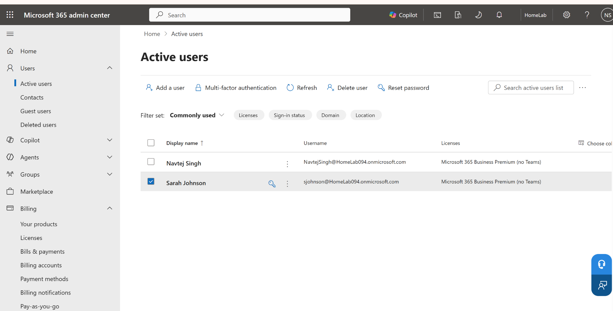

**Skills demonstrated:** Microsoft 365 administration, user provisioning, licensing, identity management

---

## 2. Self-Service Password Reset

Configured Microsoft Entra Self-Service Password Reset and successfully tested the password-reset workflow after completing the required authentication registration.

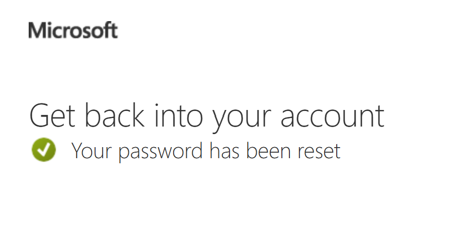

**Skills demonstrated:** SSPR, Microsoft Authenticator, MFA, identity administration, password troubleshooting

---

## 3. Windows Device Enrollment & Compliance

Successfully enrolled **INTUNE-CLIENT01** into Microsoft Intune, verified corporate device management, and confirmed that the Windows 11 endpoint reached a compliant state.

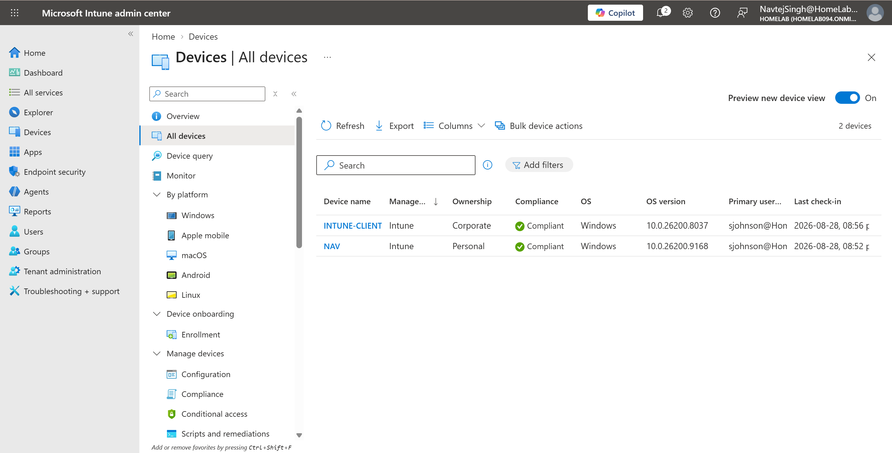

**Skills demonstrated:** Microsoft Intune, Windows 11 enrollment, corporate device management, MDM, device compliance, endpoint verification

---

## 4. Intune Compliance Troubleshooting

Investigated Intune compliance issues, corrected the configuration, synchronized the endpoint, and verified that the device returned to a compliant state.

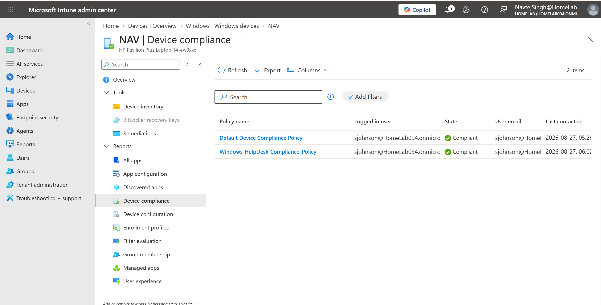

**Skills demonstrated:** Intune troubleshooting, compliance policies, device synchronization, root-cause analysis

---

## 5. Microsoft Entra Join Verification

Verified the Windows endpoint's Microsoft Entra join state using `dsregcmd`.

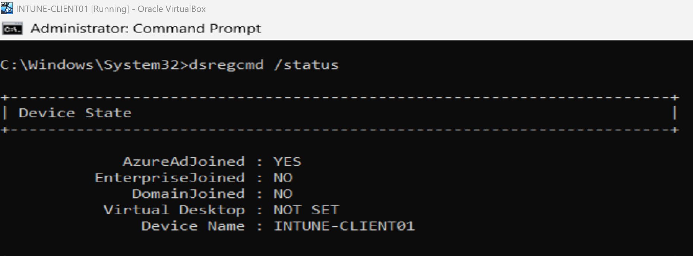

This provided endpoint-side confirmation of cloud device identity instead of relying only on portal status.

**Skills demonstrated:** Microsoft Entra ID, Windows device identity, command-line troubleshooting, verification

---

## 6. Intune Policy Enforcement

Created and assigned an Intune configuration policy that restricted access to Control Panel and Windows Settings for the targeted user.

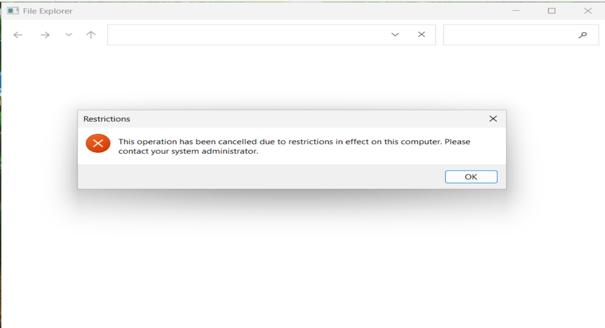

The policy was tested directly from the managed Windows endpoint to confirm successful enforcement.

**Skills demonstrated:** Intune configuration profiles, policy targeting, Windows restrictions, endpoint validation

---

## 7. Application Deployment Through Intune

Assigned VLC as a required application through Microsoft Intune and verified successful deployment on the managed Windows endpoint.

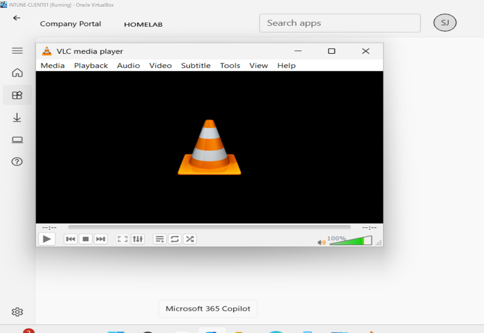

**Skills demonstrated:** application deployment, Intune app management, required assignments, endpoint verification

---

## 8. iPhone Enrollment & Compliance

Enrolled an iPhone into Microsoft Intune and verified that the mobile device was successfully managed and compliant.

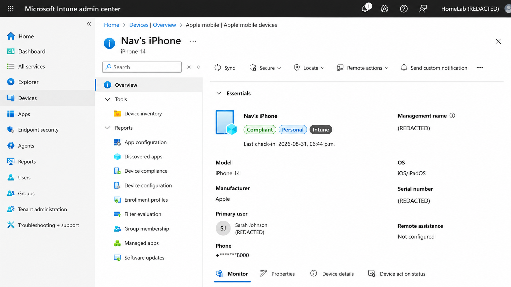

This extended the lab beyond Windows endpoint management into mobile device administration.

**Skills demonstrated:** iOS management, mobile device enrollment, Intune MDM, device compliance

---

## 9. iOS Policy Enforcement

Created an iOS device-restriction policy, synchronized the iPhone, and verified successful policy application.

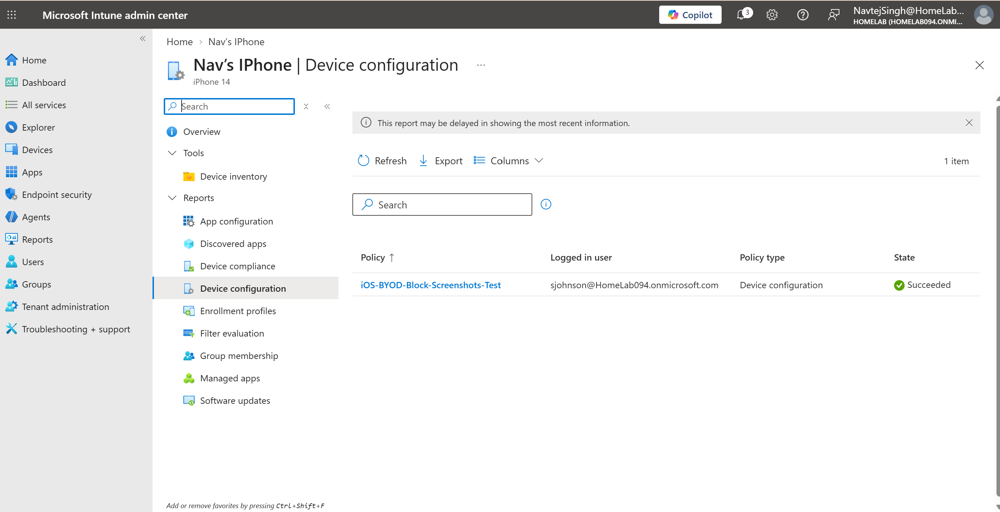

**Skills demonstrated:** mobile configuration policies, iOS restrictions, Intune policy deployment, testing and verification

---

## 10. Conditional Access Testing

Created a Microsoft Entra Conditional Access policy requiring a compliant device and evaluated the policy safely in **Report-only mode**.

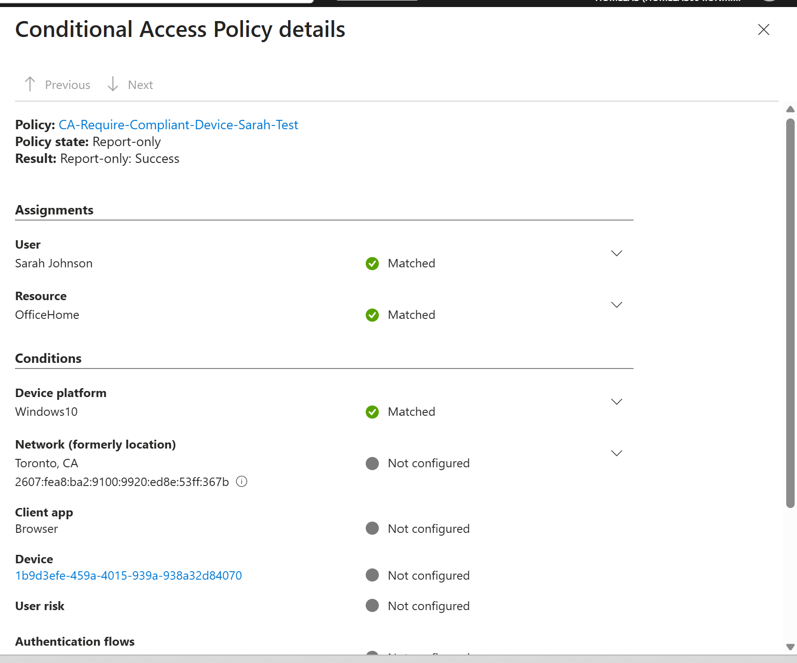

Using Report-only mode allowed the access conditions to be tested before enforcing restrictions.

**Skills demonstrated:** Conditional Access, identity security, compliant-device access control, safe policy testing

---

## 11. Microsoft 365 Shared Mailbox Administration

Configured Microsoft 365 shared mailbox access and assigned mailbox permissions to a user.

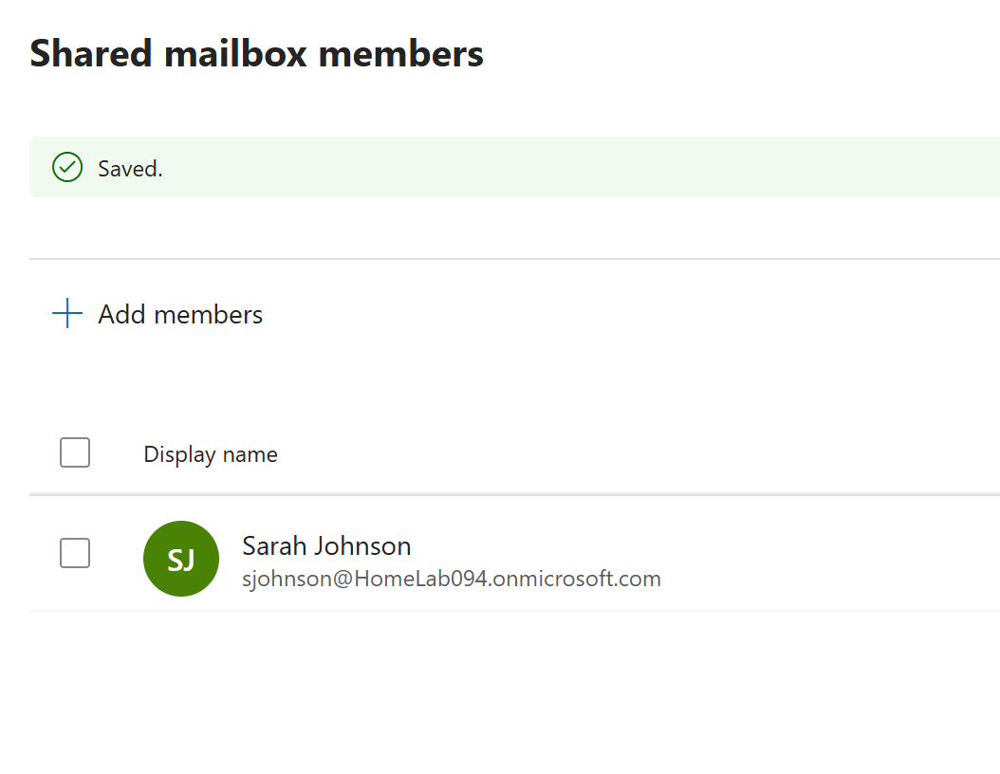

**Skills demonstrated:** Microsoft 365 administration, shared mailboxes, delegation, Help Desk support

---

# Help Desk & Endpoint Troubleshooting Scenarios

| Scenario | Troubleshooting and Resolution | Result |
|---|---|---|
| User could not complete SSPR | Reviewed authentication registration, added Microsoft Authenticator, and re-tested password reset | SSPR completed successfully |
| MFA/SSPR registration was incomplete | Checked the user's security information and required authentication methods | Authentication registration completed |
| Intune device showed mixed compliance | Reviewed policy assignment, device status, and synchronization | Compliance status corrected |
| Custom compliance policy produced errors | Investigated policy configuration and Intune reporting | Configuration corrected and status verified |
| Defender/compliance SyncML error appeared | Reviewed compliance reporting and endpoint synchronization | Compliance issue resolved |
| Secure Boot requirement failed | Identified Secure Boot as the compliance cause and corrected the endpoint configuration | Device returned to compliant state |
| User policy required verification | Tested the restriction directly from the targeted Windows account | Policy enforcement confirmed |
| Intune application required deployment verification | Assigned VLC as required and checked the managed endpoint | Application installed successfully |
| iPhone policy required validation | Synchronized the mobile device and reviewed policy status | iOS restriction policy succeeded |
| Conditional Access required safe testing | Used Report-only mode before enforcement | Policy evaluation verified without blocking access |

---

# Microsoft 365 User Administration

The Microsoft 365 administration portion of the lab included:

- User creation
- Microsoft 365 Business Premium license assignment
- User-account review
- Password resets
- Help Desk-style account administration
- Security-group membership
- Shared mailbox permissions
- User-access verification

---

# Microsoft Entra ID, MFA & SSPR

The identity-management portion included:

- Microsoft Entra user administration
- Security-group creation
- Self-Service Password Reset configuration
- Microsoft Authenticator registration
- Authentication-method management
- MFA registration
- SSPR testing
- Password-reset troubleshooting
- Microsoft Entra device join
- Conditional Access testing

---

# Microsoft Intune Administration

The Intune portion included:

- Automatic MDM enrollment
- Windows device enrollment
- Device inventory
- Device compliance
- Configuration profiles
- Compliance policies
- Policy assignments
- Device synchronization
- Remote device actions
- Company Portal
- Application deployment
- Windows policy enforcement
- Endpoint troubleshooting

---

# Endpoint Security & Compliance

Security and compliance work included:

- Microsoft Defender configuration
- Windows Firewall management
- Disk-encryption settings
- Security requirements
- Secure Boot compliance
- Compliance-policy troubleshooting
- Device synchronization
- Policy-result verification
- Final compliant-state validation

---

# Windows Device Management

Windows endpoint administration included:

- Microsoft Entra join
- Intune enrollment
- Windows 11 management
- `dsregcmd` verification
- `whoami` verification
- User-targeted configuration policies
- Local administrator testing
- Device inventory
- Company Portal
- Remote device-management actions
- Application deployment

---

# iOS Mobile Device Management

The iOS portion included:

- Apple MDM push-certificate configuration
- iOS MDM enrollment configuration
- iPhone enrollment
- Intune compliance verification
- Mobile configuration-policy creation
- Screenshot restriction testing
- Device synchronization
- Policy-success verification

---

# Conditional Access

The Conditional Access portion included:

- Creating a Microsoft Entra Conditional Access policy
- Targeting cloud resources
- Requiring a compliant device
- Testing policy behavior
- Using Report-only mode
- Reviewing policy evaluation

Report-only mode was used intentionally so the configuration could be validated before enforcing access restrictions.

---

# Application Deployment

Application-management tasks included:

- Microsoft Company Portal
- Required-app assignment
- VLC application deployment
- Intune assignment verification
- Managed-endpoint installation testing
- Successful deployment validation

---

# Commands & Verification Tools

Commands used during endpoint verification included:

```powershell
dsregcmd /status
whoami
```

I used endpoint-side verification together with the **Microsoft Intune Admin Center, Microsoft Entra Admin Center, Microsoft 365 Admin Center, and Company Portal** rather than relying on a single management console.

---

# Troubleshooting Method

I followed a structured troubleshooting workflow throughout the lab:

**Understand → Check → Test → Fix → Verify → Document**

Examples included:

- Understanding the reported or observed issue
- Checking user, device, policy, and compliance status
- Testing from both the administration portal and affected endpoint
- Identifying the configuration responsible for the issue
- Applying the appropriate correction
- Synchronizing the managed device
- Verifying the result from the endpoint
- Saving evidence and documenting the final state

---

# Complete Documentation

The screenshots displayed above are selected examples intended for recruiters and hiring managers.

The repository also contains the complete step-by-step technical evidence from the lab.

<details>
<summary><strong>📸 View All Lab Screenshots & Evidence</strong></summary>

### Microsoft 365 User Creation & Licensing

[View Microsoft 365 User Administration Screenshots](./Screenshots/01-Microsoft-365-User-Creation/)

### Microsoft Entra ID SSPR & MFA

[View Entra ID SSPR & MFA Screenshots](./Screenshots/02-Entra-ID-SSPR-MFA/)

### Intune Enrollment & MDM

[View Intune Enrollment & MDM Screenshots](./Screenshots/03-Intune-Enrollment-MDM/)

### Intune Policies, Compliance & Troubleshooting

[View Compliance & Troubleshooting Screenshots](./Screenshots/04-Intune-Policies-Compliance-Troubleshooting/)

### Intune Device Management & Security

[View Device Management & Security Screenshots](./Screenshots/05-Intune-Device-Management-Security/)

### Microsoft Entra Join & Windows Management

[View Entra Join & Windows Management Screenshots](./Screenshots/06-Entra-Join-Windows-Management/)

### Company Portal & Application Deployment

[View Company Portal & App Deployment Screenshots](./Screenshots/07-Company-Portal-App-Deployment/)

### Intune iOS Mobile Management

[View iOS Mobile Management Screenshots](./Screenshots/08-Intune-iOS-Mobile-Management/)

### Microsoft Entra Conditional Access

[View Conditional Access Screenshots](./Screenshots/09-Entra-Conditional-Access/)

### Microsoft 365 Mail Administration

[View Shared Mailbox Administration Screenshots](./Screenshots/10-Microsoft-365-Mail-Administration/)

</details>

---

# Screenshot Structure

```text
Screenshots/
│
├── 01-Microsoft-365-User-Creation/
├── 02-Entra-ID-SSPR-MFA/
├── 03-Intune-Enrollment-MDM/
├── 04-Intune-Policies-Compliance-Troubleshooting/
├── 05-Intune-Device-Management-Security/
├── 06-Entra-Join-Windows-Management/
├── 07-Company-Portal-App-Deployment/
├── 08-Intune-iOS-Mobile-Management/
├── 09-Entra-Conditional-Access/
└── 10-Microsoft-365-Mail-Administration/
```

---

# What I Learned

This project strengthened my understanding of how **Microsoft 365, Microsoft Entra ID, and Microsoft Intune work together** to manage users, identities, Windows endpoints, mobile devices, applications, security policies, and access controls.

More importantly, the lab reinforced the difference between simply creating a policy and proving that it works.

For each major configuration, I tested the result from the user or device side, reviewed management-console status, investigated failures, applied corrections, synchronized the endpoint, and verified the final state.

The compliance troubleshooting exercises reinforced how device health, policy requirements, endpoint configuration, and Intune reporting interact. A device showing as noncompliant is not the root cause by itself; the underlying requirement must be identified and corrected before compliance can be restored.

The lab improved my ability to administer Microsoft cloud services, reproduce support scenarios, troubleshoot endpoint-management problems, verify fixes, and document technical work clearly.

---

# Skills Demonstrated

**Microsoft 365 Administration | Microsoft Entra ID | Microsoft Intune | Windows 11 | iOS MDM | MFA | SSPR | Conditional Access | Endpoint Security | Device Compliance | Application Deployment | Shared Mailboxes | Technical Troubleshooting**

---

# Related Projects

 [Active Directory Help Desk Lab](https://github.com/Navtej8000/Active-Directory-Help-Desk-Lab)

Hands-on Windows Server and Active Directory lab covering user and group administration, Group Policy, account lockout troubleshooting, file permissions, PowerShell onboarding, and domain support.

 [DNS, DHCP & Network Troubleshooting Lab](https://github.com/Navtej8000/DNS-DHCP-Network-Troubleshooting-Lab)

Networking lab covering DNS, DHCP, IP addressing, APIPA recovery, RRAS/NAT, routing, subnetting, Windows Firewall troubleshooting, and structured network diagnostics.

---

# Career Relevance

The hands-on skills demonstrated in this project align with responsibilities commonly found in:

- Help Desk Technician
- IT Support Specialist
- Desktop Support Technician
- Service Desk Analyst
- Endpoint Support Technician
- Microsoft 365 Support
- Junior Systems Administrator

---

# Author & Contact

**Navtej Singh**  
IT Support | Help Desk | Microsoft 365 | Intune | Entra ID | Active Directory | Networking  
Brampton, Ontario, Canada

[LinkedIn](https://www.linkedin.com/in/navtej-singh-4162351a5/) | [Email](mailto:singhnavtej824@gmail.com) | [GitHub](https://github.com/Navtej8000)

[GitHub Profile](https://github.com/Navtej8000)

