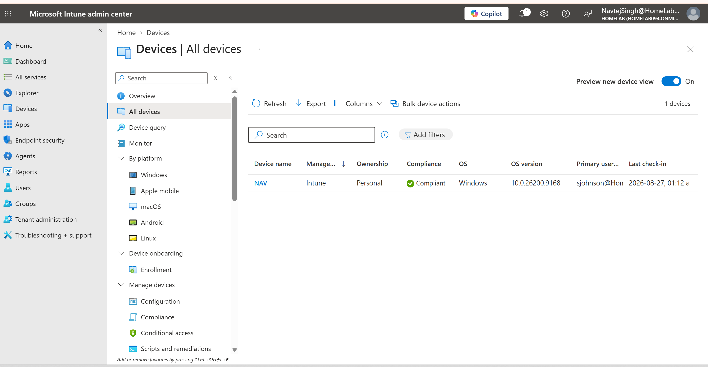

# Microsoft 365, Intune & Entra ID Administration Lab

Hands-on enterprise IT administration lab focused on **Microsoft 365, Microsoft Entra ID, Microsoft Intune, Windows endpoint management, iOS device management, security, compliance, application deployment, Conditional Access, and Help Desk administration**.

This project demonstrates practical skills relevant to **Help Desk, IT Support, Desktop Support, Endpoint Support, and Junior Systems Administration** roles.

---

## Project Overview

In this lab, I built and managed a Microsoft cloud environment using Microsoft 365 Business Premium, Microsoft Entra ID, and Microsoft Intune.

The environment was used to simulate common real-world IT support and endpoint administration tasks, including:

- Creating and licensing Microsoft 365 users
- Resetting passwords and managing user access
- Configuring Self-Service Password Reset (SSPR)
- Configuring Microsoft Authenticator and MFA
- Enrolling Windows devices into Microsoft Intune
- Joining Windows devices to Microsoft Entra ID
- Creating configuration and compliance policies
- Troubleshooting device compliance failures
- Managing endpoint security settings
- Deploying applications through Intune
- Managing iOS devices
- Enforcing mobile device policies
- Testing Conditional Access safely in Report-only mode
- Managing Microsoft 365 shared mailbox access

---

## Technologies Used

| Technology | Purpose |
|---|---|
| Microsoft 365 Business Premium | Cloud productivity and administration platform |
| Microsoft Entra ID | Identity, authentication, device join, and access management |
| Microsoft Intune | Endpoint enrollment, compliance, configuration, and application management |
| Windows 11 | Managed Windows endpoint |
| Microsoft Authenticator | MFA and SSPR authentication |
| Microsoft Company Portal | Device enrollment and application delivery |
| Microsoft Defender | Endpoint security and antivirus management |
| iOS / iPhone | Mobile device enrollment and management |
| Conditional Access | Identity-based access control |
| Microsoft 365 Shared Mailbox | Help Desk-style mailbox delegation and administration |

---

# Key Skills Demonstrated

### Identity & User Administration

- Created Microsoft 365 user accounts
- Assigned Microsoft 365 Business Premium licenses
- Performed Help Desk-style password resets
- Configured SSPR
- Registered Microsoft Authenticator
- Tested MFA and authentication methods
- Managed Microsoft Entra ID users and groups

### Microsoft Intune Administration

- Configured automatic MDM enrollment
- Enrolled Windows devices into Intune
- Verified device inventory and management status
- Created configuration profiles
- Created and assigned compliance policies
- Performed remote device management actions
- Synchronized devices with Intune
- Verified policy deployment and enforcement

### Endpoint Security

- Managed Microsoft Defender settings
- Reviewed Windows Firewall configuration
- Worked with disk encryption settings
- Tested security-related compliance requirements
- Investigated and resolved endpoint compliance failures

### Application Deployment

- Assigned applications as required through Microsoft Intune
- Deployed VLC through Intune
- Verified successful application installation on the managed endpoint

### Mobile Device Management

- Configured Apple MDM integration
- Enrolled an iPhone into Microsoft Intune
- Verified iOS device compliance
- Created an iOS configuration policy
- Tested policy synchronization and enforcement

### Access & Microsoft 365 Administration

- Tested Conditional Access using Report-only mode
- Verified Conditional Access policy evaluation
- Created and configured a Microsoft 365 shared mailbox
- Assigned mailbox permissions to a user

---

# Selected Lab Evidence

The screenshots below highlight the strongest outcomes from the lab.  
The complete evidence set is available in the [`Screenshots`](./Screenshots/) directory.

---

## 1. Microsoft 365 User & License Administration

Created a Microsoft 365 user and verified successful Microsoft 365 Business Premium license assignment.


**Skills demonstrated:**  
Microsoft 365 administration, user provisioning, licensing, identity management

---

## 2. Self-Service Password Reset

Configured and successfully tested Microsoft Entra Self-Service Password Reset.


**Skills demonstrated:**  
SSPR, authentication, Microsoft Authenticator, identity troubleshooting

---

## 3. Windows Device Enrolled & Compliant

Successfully enrolled a Windows endpoint into Microsoft Intune and verified that the device reached a compliant state.



**Skills demonstrated:**  
Intune enrollment, MDM, Windows endpoint management, compliance

---

## 4. Intune Compliance Troubleshooting

Investigated Intune compliance issues, corrected the configuration, synchronized the device, and restored compliance.


**Skills demonstrated:**  
Troubleshooting, compliance policies, Intune synchronization, root-cause analysis

---

## 5. Microsoft Entra Join Verification

Verified that the Windows endpoint was successfully joined to Microsoft Entra ID using `dsregcmd`.


**Skills demonstrated:**  
Microsoft Entra ID, Windows device identity, command-line troubleshooting, verification

---

## 6. Intune Policy Enforcement

Created and assigned an Intune configuration policy that restricted access to Control Panel and Windows Settings for the targeted user.


**Skills demonstrated:**  
Intune configuration profiles, policy targeting, endpoint restrictions, validation

---

## 7. Application Deployment with Intune

Deployed VLC as a required application through Microsoft Intune and verified successful installation on the managed Windows device.


**Skills demonstrated:**  
Application deployment, Intune app management, required assignments, endpoint validation

---

## 8. iPhone Enrollment & Compliance

Enrolled an iPhone into Microsoft Intune and verified that the mobile device was successfully managed and compliant.


**Skills demonstrated:**  
iOS management, mobile device enrollment, Intune MDM, device compliance

---

## 9. iOS Policy Enforcement

Created an iOS device restriction policy, synchronized the device, and verified successful policy enforcement.


**Skills demonstrated:**  
Mobile configuration policies, iOS restrictions, Intune policy deployment, testing

---

## 10. Conditional Access Testing

Created and evaluated a Microsoft Entra Conditional Access policy requiring a compliant device.

The policy was tested in **Report-only mode**, allowing the access conditions to be validated safely before enforcement.


**Skills demonstrated:**  
Conditional Access, identity security, compliant-device controls, safe policy testing

---

## 11. Microsoft 365 Shared Mailbox Administration

Configured a Microsoft 365 shared mailbox and assigned mailbox access permissions to a user.


**Skills demonstrated:**  
Microsoft 365 administration, shared mailboxes, delegation, Help Desk support

---

# Troubleshooting Highlights

A major focus of this project was not simply configuring services, but **testing, breaking, troubleshooting, and validating them**.

### SSPR / MFA Registration Issue

**Issue:**  
Password reset and MFA functionality initially failed because the test user did not have the required authentication method registered.

**Resolution:**

- Reviewed the user's authentication methods
- Registered Microsoft Authenticator
- Re-tested authentication
- Successfully completed Self-Service Password Reset

---

### Intune Compliance Issue

**Issue:**  
The Windows endpoint reported compliance and policy-related errors during testing.

**Troubleshooting performed:**

- Reviewed Intune compliance status
- Checked assigned compliance requirements
- Investigated policy errors
- Triggered device synchronization
- Corrected configuration issues
- Verified the device returned to a compliant state

---

### Secure Boot Compliance

During compliance testing, the Windows device reported a Secure Boot-related failure.

The issue was investigated and corrected, followed by another Intune synchronization to confirm the endpoint returned to a healthy compliant state.

This provided hands-on experience with the troubleshooting workflow:

**Identify → Investigate → Correct → Synchronize → Verify**

---

# Lab Evidence Structure

All screenshots are organized by technology and task area:

```text
Screenshots/
│
├── 01-Microsoft-365-User-Creation/
├── 02-Entra-ID-SSPR-MFA/
├── 03-Intune-Enrollment-MDM/
├── 04-Intune-Policies-Compliance-Troubleshooting/
├── 05-Intune-Device-Management-Security/
├── 06-Entra-Join-Windows-Management/
├── 07-Company-Portal-App-Deployment/
├── 08-Intune-iOS-Mobile-Management/
├── 09-Entra-Conditional-Access/
└── 10-Microsoft-365-Mail-Administration/

## Related Projects

### Active Directory Help Desk Lab
Hands-on Windows Server and Active Directory lab covering user and group administration, Group Policy, account lockout troubleshooting, file permissions, PowerShell onboarding, and domain support.

[View Active Directory Help Desk Lab](https://github.com/Navtej8000/Active-Directory-Help-Desk-Lab)

### DNS, DHCP & Network Troubleshooting Lab
Networking lab covering DNS, DHCP, IP addressing, NAT, routing, VLAN/subnet concepts, connectivity testing, and common network troubleshooting scenarios.

[View DNS, DHCP & Network Troubleshooting Lab](https://github.com/Navtej8000/DNS-DHCP-Network-Troubleshooting-Lab)
